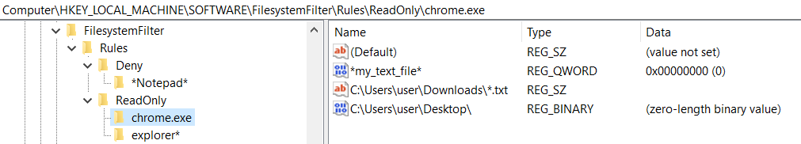
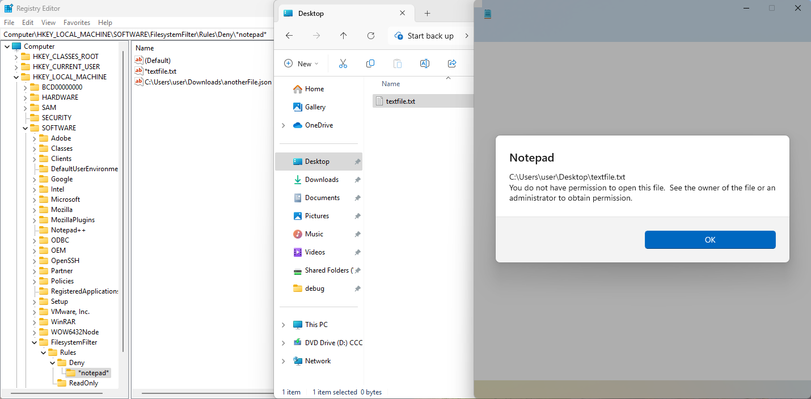

# Filesystem filter driver (Rust)
Minifilter driver in Rust. Reads protection rules from the registry and applies them to filesystem operations performed by processes.

## Overview
The kernel mode driver is a file system minifilter. It monitors file creation, opening, and renaming. It supports two types of file operation filtering rules: Deny, Read Only.

### File operation filtering rules:
 - Deny - denies any access to the file for the specified process;
 - ReadOnly - prevents modification (write, delete, rename, etc.).

### Rules management
At startup, the driver reads rules from the registry in the “HKEY_LOCAL_MACHINE\SOFTWARE\FilesystemFilter\Rules” key. This key can contain the following types of connections: “Deny”, “ReadOnly” (each corresponding to a specific rule type).

Each rule type can include multiple process names.

Process names support wildcards. The process name case is ignored. Each process key can contain any number of values.

Each value means the path to a file for which access filtering by the specified process should be applied. The type of the value does not matter, because the driver only reads the value name. The case of the value (file path) is ignored. The file path also supports wildcards.

If there is no registry rule for the file on which a file operation is performed, the minifilter skips it without modification.

### Dynamic rule updating
The driver also supports dynamic rule updating. You can create and delete registry keys corresponding to a rule type, process name or file path and these changes will be instantly applied to the rule store in the registry. You can also rename *process names* and *file paths*, and these changes will be handled correctly.

### Rules structure example

### Rules priority
The types of protection rules have different priorities. The driver supports “Deny” and “ReadOnly” rule types.
Priority:
1) Deny
2) ReadOnly

Rules are checked in this order. If a matching rule is found under “Deny”, no further checks are performed, and access is denied immediately. If no matching rule is found in 'Deny', the driver will then check 'ReadOnly'. If the rule was not found in any section, the filter does not perform any action.

### Rules for folders and files
- The kernel cannot reliably determine whether a path is a **file** or a **folder**.
- To specify a **folder**, add `\` to the end of the path.
- This ensures filtering applies to the **folder and all its contents**.

### Applying Rules to Parent Processes
The rules apply not only to the process specified in the rules, but also to the parent process. This is used to support filtering of processes that perform file operations using child processes (for example, web view-based applications). First, the driver searches for rules matching the specified process in the registry. Then, it checks whether the parent process is still running. If so, the driver looks for a matching rule based on the file path and process name of the *parent process* and applies the appropriate action.

## Example

## Building
The [wdk-build](https://github.com/microsoft/windows-drivers-rs/tree/main/crates/wdk-build) crate from the [windows-drivers-rs](https://github.com/microsoft/windows-drivers-rs) platform is used to build this project. The build is performed using the [cargo-make](https://github.com/sagiegurari/cargo-make) task runner. It is enough just to run the command “cargo make” to build the project. Or you can use the [cargo-wdk](https://github.com/microsoft/windows-drivers-rs/tree/main/crates/cargo-wdk) tool to build the driver using “cargo wdk build” command.

To build the project correctly using “cargo make” or “cargo wdk build”, it is necessary to prepare the environment beforehand and install the missing components according to the instructions described in [windows-drivers-rs](https://github.com/microsoft/windows-drivers-rs) repo.

## Author
**Dmytro Maslo**
[Apriorit](https://www.apriorit.com/)